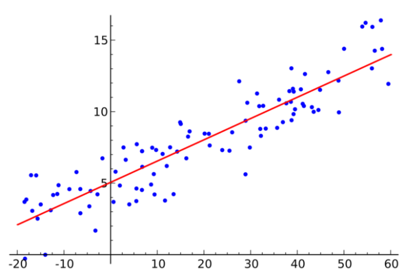
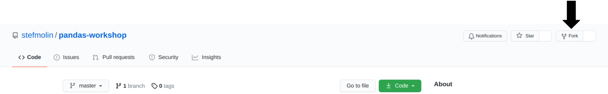
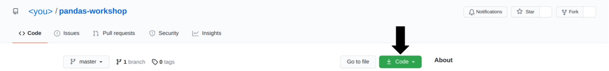
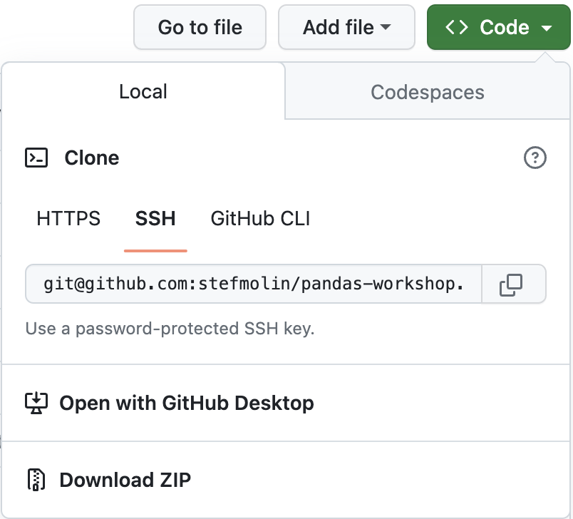
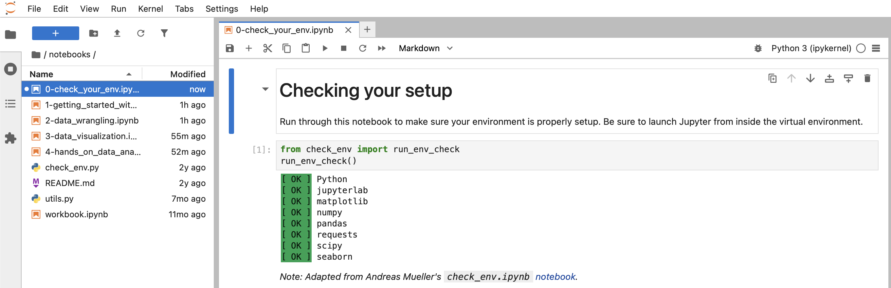
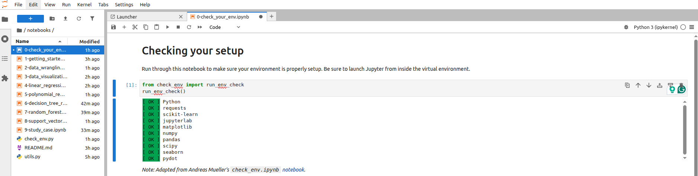
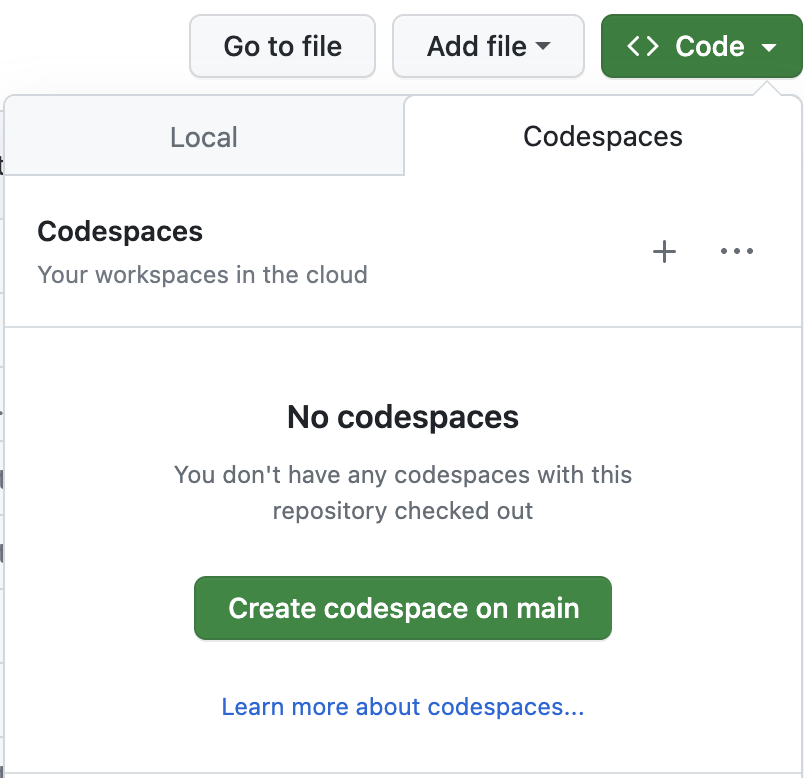
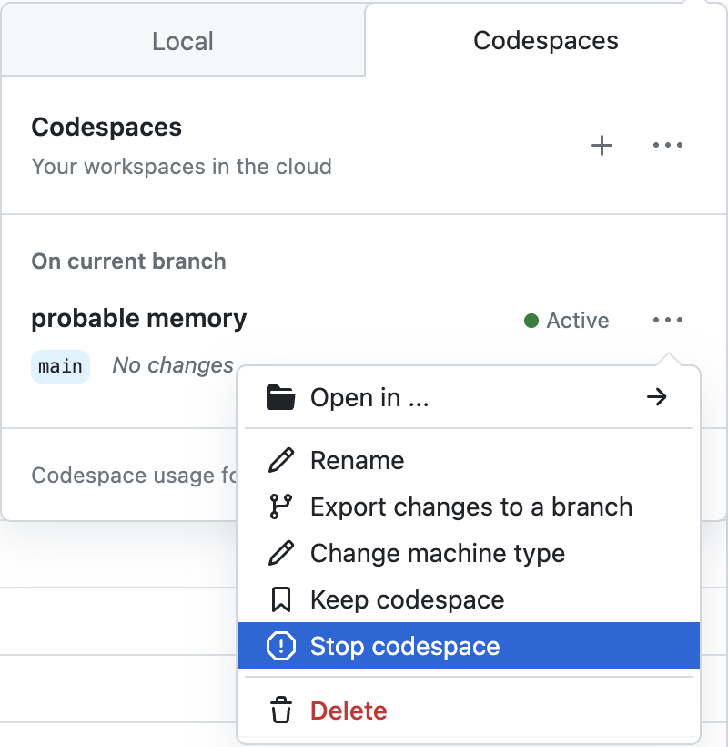

# Tutorial on Machine Learning Techniques for Regression Analysis

## Introduction

Regression analysis is a form of predictive modelling technique which investigates the relationship between a dependent (target) and independent variable (s) (predictor). In simple terms the regression can be defined as, “Using the relationship between variables to find the best fit line or the regression equation that can be used to make predictions”.



This technique is used for forecasting, time series modelling and finding the causal effect relationship between the variables. There are various kinds of regression techniques available to make predictions. These techniques are mostly driven by three metrics (number of independent variables, type of dependent variables and shape of regression line).

### Model evaluation 

Model evaluation leads a Data Scientist in the right direction to select or tune an appropriate model.There are three main errors (metrics) used to evaluate regression models, Mean absolute error, Mean Squared error and R2 score.

**Mean Absolute Error (MAE)** tells us the average error in units of y, the predicted feature. A value of 0 indicates a perfect fit. 

**Root Mean Square Error (RMSE)** indicates the average error in units of y, the predicted feature, but penalizes larger errors more severely than MAE. A value of 0 indicates a perfect fit. 

**R-squared (R2 )** tells us the degree to which the model explains the variance in the data. In other words how much better it is than just predicting the mean. 
+ A value of 1 indicates a perfect fit.
+ A value of 0 indicates a model no better than the mean. 
+ A value less than 0 indicates a model worse than just predicting the mean.

### REFERENCES 

- https://scikit-learn.org/
- https://towardsdatascience.com/linear-regression-using-python-b136c91bf0a2
- https://www.statisticssolutions.com/what-is-logistic-regression/
- https://medium.com/analytics-vidhya/understanding-polynomial-regression-5ac25b970e18
- https://data-flair.training/blogs/svm-support-vector-machine-tutorial/
- https://medium.com/swlh/random-forest-and-its-implementation-71824ced454f
- https://medium.com/@bhartendudubey/decision-tree-regression-e202008c2df
- https://www.analyticsvidhya.com/blog/2015/08/comprehensive-guide-regression/
- https://openclassrooms.com/en/courses/6401081-improve-the-performance-of-a-machine-learning-model/6519016-evaluate-the-performance-of-a-regression-model

--- 

## Prerequisites
You should have basic knowledge of Python and be comfortable working in Jupyter Notebooks. Check out [this notebook](https://github.com/stefmolin/Hands-On-Data-Analysis-with-Pandas-2nd-edition/blob/master/ch_01/python_101.ipynb) for a crash course in Python or work through the [official Python tutorial](https://docs.python.org/3/tutorial/) for a more formal introduction. The environment we will use for this workshop comes with JupyterLab, which is pretty intuitive, but be sure to familiarize yourself [using notebooks in JupyterLab](https://jupyterlab.readthedocs.io/en/latest/user/notebook.html) and [additional functionality in JupyterLab](https://dzone.com/articles/getting-started-with-jupyterlab).

--- 

## Setup Instructions

Pick the installation option that makes sense for you:

- [Local Installation](#local-installation)
<!-- - [Docker Container](#docker-installation) -->
- [Cloud Service](#cloud-options)

### Local Installation
**Warning**: It is highly recommended that you use your personal laptop for the installation.

1. Install [Git](https://git-scm.com/book/en/v2/Getting-Started-Installing-Git), if not already installed on your computer.
2. Clone the repository:

    ```shell
    $ git clone https://github.com/germanftv/ml-regression-tutorial.git
    ```

<!-- 2. Fork this repository:

    

3. Navigate to your fork, and click the **Code** button:

    

4. Clone your forked repository using the desired method from the **Local** tab:

     -->

3. Install [Miniconda](https://docs.conda.io/en/latest/miniconda.html) by following [these instructions](https://www.anaconda.com/docs/getting-started/miniconda/install#command-prompt):
    - Optional: Install [VSCode](https://code.visualstudio.com/docs/setup/setup-overview)

4. Set up your environment with `conda` (on Windows, these commands should be run in **Anaconda Prompt**) and launch JupyterLab:

    ```shell
    $ cd ml-regression-tutorial
    ~/ml-regression-tutorial$ conda env create --file environment.yml
    ~/ml-regression-tutorial$ conda activate ml-regression-tutorial
    (ml-regression-tutorial) ~/ml-regression-tutorial$ jupyter lab
    ```

    >Note:
    >Here’s how you can start **Anaconda Prompt** on Windows:
    >
    >✅ **Method 1: From Start Menu**
    >1. Press the **Windows key** (or click the Start menu).
    >2. Type:  
    >   ```anaconda prompt```
    >3. Click on **Anaconda Prompt** from the search results.
    >
    >✅ **Method 2: From Anaconda Navigator**
    >If you already have Anaconda Navigator open:
    >1. Open **Anaconda Navigator** (find it in the Start menu).
    >2. On the Navigator home screen, you’ll see an option to launch **Anaconda Prompt**.


5. Navigate to the `0-check_your_env.ipynb` notebook in the `notebooks/` folder:

    

6. Run the notebook to confirm everything is set up properly:

    


### Cloud Options

#### GitHub Codespaces

[](https://codespaces.new/germanftv/ml-regression-tutorial)

The [GitHub Codespaces](https://github.com/features/codespaces) setup provides a pre-configured machine accessible via your browser. You will need a GitHub account and available quota (all users get more than enough free monthly quota to be able to run this workshop). Note that this will take a while to build. It's recommended that you click the badge above to build the codespace in advance of the workshop and then [stop the codespace](https://docs.github.com/en/codespaces/developing-in-codespaces/stopping-and-starting-a-codespace) until the workshop, at which point you can simply resume and pick up where you left off.

Note that if you want to save your changes, you will need to fork the repository before creating the codespace. You will then be able to commit your changes directly from the codespace. Be sure to create your codespace in advance of the session and resume when we start.

1. Create GitHub account, if you do not have one already. Follow [these instructions](https://docs.github.com/en/get-started/start-your-journey/creating-an-account-on-github).
    > Recommended: Apply for GitHub education:
    > - [As a student](https://docs.github.com/en/education/about-github-education/github-education-for-students/apply-to-github-education-as-a-student) 
    > - [As a teacher](https://docs.github.com/en/education/about-github-education/github-education-for-teachers/apply-to-github-education-as-a-teacher)

1. Fork this repository:

    

2. Navigate to your fork, and click the **Code** button:

    

3. Launch the codespace from your fork by clicking on the **+** or **Create codespace on main** button in the **Codespaces** tab:

    

4. Stop the codespace until the session starts by selecting **Stop codespace** from the **...** menu.

    

5. To resume the codespace, click **Open in ...** and then select your preferred method. If you aren't sure, select JupyterLab.

    

## Acknowledgements
This tutorial compiles and adapts materials from multiple open-source repositories. All the credit goes to the original contributors:

- [Ansu-John/Regression-Models](https://github.com/Ansu-John/Regression-Models.git)
- [IBM/ml-learning-path-assets](https://github.com/IBM/ml-learning-path-assets)
- [stefmolin/pandas-workshop](https://github.com/stefmolin/pandas-workshop)


## License

This tutorial is licensed under <a href="https://creativecommons.org/licenses/by-nc-sa/4.0/?ref=chooser-v1" target="_blank" rel="license noopener noreferrer" style="display:inline-block;">CC BY-NC-SA 4.0</a></p>

[![CC BY-NC-SA 4.0][cc-by-nc-sa-image]][cc-by-nc-sa]

[cc-by-nc-sa]: http://creativecommons.org/licenses/by-nc-sa/4.0/
[cc-by-nc-sa-image]: https://licensebuttons.net/l/by-nc-sa/4.0/88x31.png
[cc-by-nc-sa-shield]: https://img.shields.io/badge/License-CC%20BY--NC--SA%204.0-lightgrey.svg

<!--
## Related Content
All examples herein were developed exclusively for this workshop. [Hands-On Data Analysis with Pandas](https://www.amazon.com/dp/1800563450/) contains additional examples and exercises, as does [this article](https://stefaniemolin.com/articles/data-science/how-to-pivot-and-plot-data-with-pandas/). For a deeper dive into data visualization in Python, check out my [Beyond the Basics: Data Visualization in Python](https://stefaniemolin.com/workshops/python-data-viz-workshop/) workshop. -->

<!-- ## License
#TODO -->
